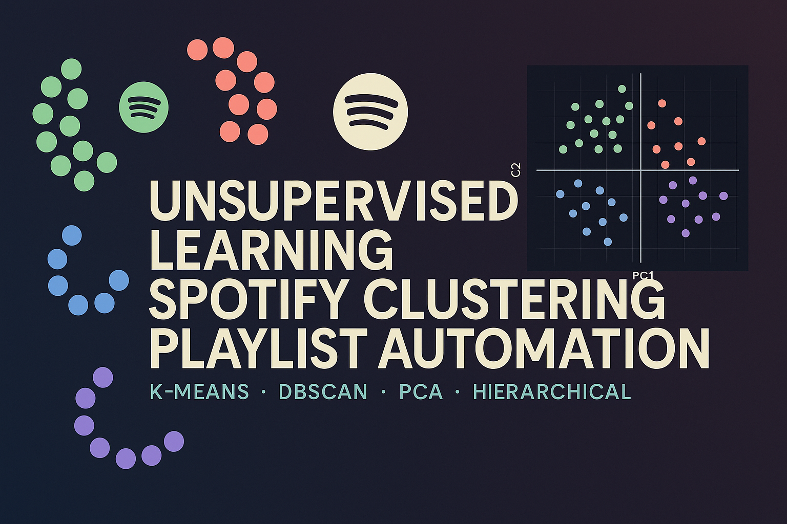

# 🎧 Moosic — Automating Playlist Creation with Machine Learning

At WBS Coding School, **Moosic** is our case study to explore how **unsupervised learning** can help automate playlist creation using **Spotify audio features**.

This project shows how clustering algorithms (K-Means, DBSCAN, and Hierarchical) can discover groups of songs that represent different *moods* or *styles* — just like human curators do.

This project was performed with Olaf Bulas.
<!-- 💡 Tech Stack Badges for the Moosic Project -->

[](https://www.python.org/)
[](https://scikit-learn.org/)
[](https://pandas.pydata.org/)
[](https://numpy.org/)
[](https://matplotlib.org/)
[](https://developer.spotify.com/documentation/web-api/)
[](https://scikit-learn.org/stable/modules/clustering.html)
[](https://scikit-learn.org/stable/modules/generated/sklearn.cluster.KMeans.html)
[](https://scikit-learn.org/stable/modules/generated/sklearn.cluster.DBSCAN.html)
[](https://scikit-learn.org/stable/modules/generated/sklearn.cluster.AgglomerativeClustering.html)
[](https://scikit-learn.org/stable/modules/generated/sklearn.decomposition.PCA.html)
[](https://jupyter.org/)
[](https://streamlit.io/)
[](./LICENSE)




---

## 🧠 Project Story

**Moosic** is a start-up specializing in curated playlists.  
As the catalog grew, human curators struggled to keep up. The question arose:

> “Can data science group songs into playlists automatically?”

This repository follows that journey — from **raw Spotify data** to **clustering-based playlist prototypes** — testing whether audio features capture musical similarity.

---

## 🎵 Dataset Overview

We used a dataset of **5,000 Spotify tracks** with 12 audio features provided by the Spotify API.

| Feature | Description |
|----------|--------------|
| `danceability` | How suitable a track is for dancing |
| `energy` | Perceptual measure of intensity |
| `valence` | Musical positivity (0 = sad, 1 = happy) |
| `acousticness` | Likelihood that the track is acoustic |
| `instrumentalness` | Probability that the track has no vocals |
| `liveness` | Presence of a live audience |
| `speechiness` | Presence of spoken words |
| `tempo` | Speed in beats per minute (BPM) |
| `loudness` | Overall volume in decibels |
| `duration_ms` | Track duration |
| `key`, `mode`, `time_signature` | Musical theory features |

Exploration showed:
- **Energy ↔ Loudness** strongly correlated (~0.85)
- **Valence** slightly bimodal (happy vs. sad)
- **Acousticness** & **Instrumentalness** highly skewed toward 0
- Most tracks around **120 BPM**, typical of pop and dance

---

## 📊 Data Exploration Highlights

From [`Spotify_5000_songs_REWRITE.ipynb`](./notebooks/Spotify_5000_songs_REWRITE.ipynb):

| Visualization | Example |
|----------------|----------|
| **Histograms** – distribution of core audio features |  |
| **Correlation heatmap** – relationships between features |  |

👉 These figures reveal why scaling is essential before clustering.

---

## 🤖 Techniques Used

This project applies **unsupervised learning** techniques to uncover musical structure.

---

### 🟢 1. K-Means Clustering

Notebook: [`1_introduction_to_kmeans_Spotify_5000_REWRITE.ipynb`](./notebooks/1_introduction_to_kmeans_Spotify_5000_REWRITE.ipynb)

- Assigns songs into *k* groups (centroids minimize within-cluster variance).  
- Explored `k = 4–30` and chose **k ≈ 20** via **Elbow** and **Silhouette** methods.  
- Each cluster represents a potential *playlist mood*.

| Visualization | Example |
|----------------|----------|
| **Elbow curve** – Inertia vs k |  |
| **Silhouette vs k** |  |
| **PCA cluster map (k=20)** |  |

**Interpretation:**  
- k ≈ 20 yields distinct, interpretable clusters (e.g., calm acoustic, upbeat pop, moody electronic).

---

### 🟠 2. PCA (Principal Component Analysis)

Notebook: [`4_PCA_Spotify_5000_REWRITE.ipynb`](./notebooks/4_PCA_Spotify_5000_REWRITE.ipynb)

- Reduced 12D audio feature space → 2D for visualization.  
- **PC1**: correlated with *energy/loudness* (intensity axis)  
- **PC2**: correlated with *valence/tempo* (mood axis)

| Visualization | Example |
|----------------|----------|
| **Scree plot** – variance explained |  |
| **PCA 2D clusters** – songs colored by K-Means labels |  |

**Interpretation:**  
Clusters in PCA space align with musical moods — validating that Spotify features capture meaningful emotional and stylistic patterns.

---

### 🔵 3. DBSCAN (Density-Based Clustering)

Notebook: [`5_DBSCAN_Spotify_5000_REWRITE.ipynb`](./notebooks/5_DBSCAN_Spotify_5000_REWRITE.ipynb)

- Finds clusters based on **local density**, automatically detects **outliers**.  
- Explored grid of `eps ∈ {0.5, 0.8, 1.0, 1.2}` and `min_samples ∈ {5, 10, 20}`.

| Visualization | Example |
|----------------|----------|
| **Parameter grid summary** – noise% vs clusters |  |
| **PCA 2D (best silhouette)** |  |

**Interpretation:**  
DBSCAN revealed niche or genre-blending tracks as outliers — useful for “discover” or “experimental” playlists.

---

### 🟣 4. Agglomerative (Hierarchical) Clustering

Notebook: [`6_AgglomerativeClustering_Spotify_5000_REWRITE.ipynb`](./notebooks/6_AgglomerativeClustering_Spotify_5000_REWRITE.ipynb)

- Builds a hierarchy of clusters from bottom-up merges.  
- Compared linkages: **Ward**, **Average**, **Complete**.  
- Hierarchy allows flexible playlist granularity.

| Visualization | Example |
|----------------|----------|
| **PCA 2D (Ward linkage)** |  |
| **Dendrogram (Ward)** |  |

**Interpretation:**  
Shows a *family tree of moods* — broad groups (Happy/Chill/Upbeat) that subdivide into more specific playlists.

---

## 🧮 Metrics Used

| Metric | Goal | Interpretation |
|---------|------|----------------|
| **Silhouette Score** | maximize | cluster separation & cohesion |
| **Davies–Bouldin Index** | minimize | distinctness of clusters |
| **Calinski–Harabasz Index** | maximize | compactness & separation |
| **Inertia** | minimize | total within-cluster variance (K-Means only) |

---

## 🧩 Scaling Comparison

Notebook: [`2_scaling_data_Spotify_5000_REWRITE.ipynb`](./notebooks/2_scaling_data_Spotify_5000_REWRITE.ipynb)

| Scaler | Description | When to Use |
|---------|--------------|-------------|
| `StandardScaler` | z-score normalization | balanced data |
| `MinMaxScaler` | rescale [0,1] | bounded features |
| `RobustScaler` | median/IQR | outliers |
| `QuantileTransformer` | maps to normal distribution | **skewed data** ✅ |

**Result:**  
`QuantileTransformer` consistently achieved the best Silhouette score and most stable K-Means clustering.

| Visualization | Example |
|----------------|----------|
| **Scaler comparison (Silhouette)** |  |

---

## 🖥️ Slides

🎞️ **Presentation:** [`Moosic_Presentation.pptx`](./slides/Moosic_Presentation.pptx)

This presentation visually summarizes the project workflow and findings:

- 🎧 The Moosic case study and business challenge  
- 📈 Data exploration highlights (Spotify audio features)  
- 🤖 Machine learning techniques: **K-Means**, **DBSCAN**, **PCA**, and **Hierarchical Clustering**  
- 🧩 Comparison of clustering results and interpretation of musical moods  
- 💡 Conclusions and recommendations for future development  

Use it alongside the notebooks to walk through both the **technical process** and the **business insights**.

## 💡 Conclusions

- Spotify’s audio features **do** capture musical similarity and mood.
- **Quantile scaling** improves all clustering results due to skewed distributions.
- **K-Means (k≈20)** produces meaningful playlists (distinct moods/styles).
- **DBSCAN** identifies outliers and niche styles.
- **Agglomerative** offers an explainable hierarchy for playlist families.
- Combining these gives both **automation** and **editorial control**.

---

## 📁 Repository Structure
```plaintext
Moosic/
├── slides/
│   └── Moosic_Presentation.pptx
├── data/
│   ├── spotify_5000_songs.csv
│   └── spotify_5000_songs.cleaned.csv
├── notebooks/
│   ├── Spotify_5000_songs_REWRITE.ipynb
│   ├── 1_introduction_to_kmeans_Spotify_5000_REWRITE.ipynb
│   ├── 2_scaling_data_Spotify_5000_REWRITE.ipynb
│   ├── 3_analysing_k_means__choosing_k_Spotify_5000_REWRITE.ipynb
│   ├── 4_PCA_Spotify_5000_REWRITE.ipynb
│   ├── 5_DBSCAN_Spotify_5000_REWRITE.ipynb
│   └── 6_AgglomerativeClustering_Spotify_5000_REWRITE.ipynb
├── reports/
│   ├── scaler_comparison_kmeans20.csv
│   ├── kmeans_sweep_results.csv
│   ├── dbscan_grid_results.csv
│   ├── agglomerative_linkage_k20.csv
│   └── plots/
│       ├── histogram_energy.png
│       ├── correlation_heatmap.png
│       ├── elbow_quantile.png
│       ├── silhouette_quantile.png
│       ├── pca2_kmeans20.png
│       ├── dbscan_best_pca.png
│       ├── agglomerative_ward_pca.png
│       ├── agglomerative_dendrogram.png
```

---

## 🧰 Requirements

```bash
pip install pandas numpy scikit-learn matplotlib scipy
```
---

## 💬 Next Steps

- 🔹 Add **genre metadata** or **lyrics sentiment** for hybrid mood detection  
- 🔹 Build a **Streamlit app** to preview and recommend songs per cluster  
- 🔹 Integrate with **Spotify’s API** to dynamically generate and test playlists  

---

## 🎵 Final Thought

Even without labels, **unsupervised learning** reveals how songs *feel* similar to each other.  
Machine learning won’t replace human taste — but it can **inspire** new playlists you’d never think to make.  

> 🎧 *“Let the data find your next favorite song.”*

---

## 📫 Contact
Carlos Victor Montefusco Pereira, PhD  
[LinkedIn](https://www.linkedin.com/in/camontefusco) | [GitHub](https://github.com/camontefusco)
